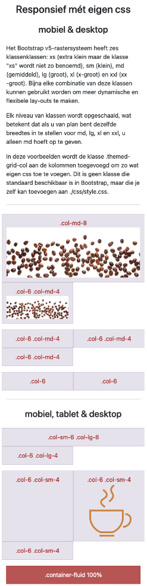
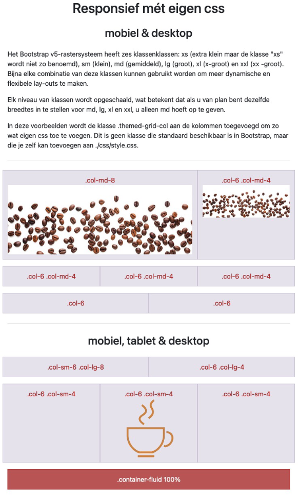

# 💻 04. Bootstrap & lay-out > oefening 03

## 🛠️ opdrachten

### `index.html` openen

- [ ] Open het bestand `index.html`.

### `style.css` koppelen

- [ ] Koppel de eigen css uit `style.css` aan de HTML.

### voorbeeld namaken

- [ ] Maak de printscreens zo goed mogelijk na.

#### printscreen iphone12 - 390x844px

#### printscreen ipad-mini 768x1024px

#### printscreen ipad-mini 1024x768px

#### printscreen nest hub max 1280x800px

