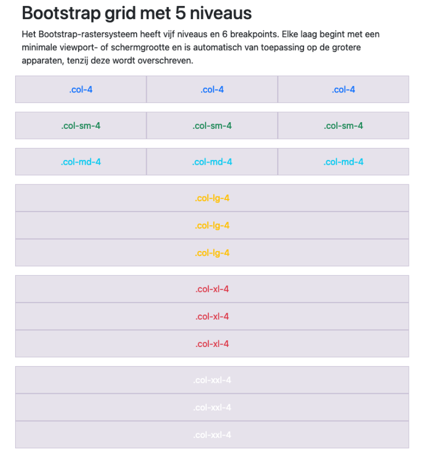

# 💻 LES: W4 - HTML & Bootstrap - Oefening 01

## 🛠️ Opdrachten

### `index.html` openen

 - [ ] Open het bestand `index.html`.

### `style.css` koppelen

- [ ] koppel de eigen css uit `style.css` aan de HTML.

### Voorbeeld Namaken

- [ ] Maak de printscreens zo goed mogelijk na.
- [ ] Maak correct gebruik van HTML5 layout-elementen (géén `
` elementen!).
- [ ] zorg voor de uitlijning van de teksten met behulp van Bootstrap.
- [ ] zorg dat alle articles de correcte tekstkleuren krijgen
- [ ] de laatste section krijgt een klasse `kleur-xxl` met een achtergrondkleur van `#cf04beb4`
    - voor de media query `@media (min-width:1400px)`
    - zie ook *laatste printscreen*

#### printscreen iphone12 - 390x844px

#### printscreen ipad-mini 768x1024px

#### printscreen ipad-mini 1024x768px

#### printscreen nest hub max 1280x800px

#### printscreen nét iets groter van 1400px

## 💡 Vragen

 - Wat is een `breakpoint` in het bootstrap Grid systeem?
 - Wat is het verschil in CSS tussen `color` en `background-color`?