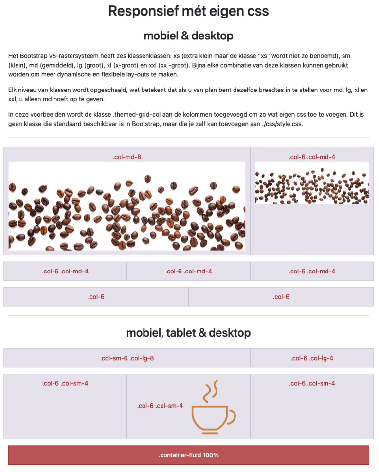
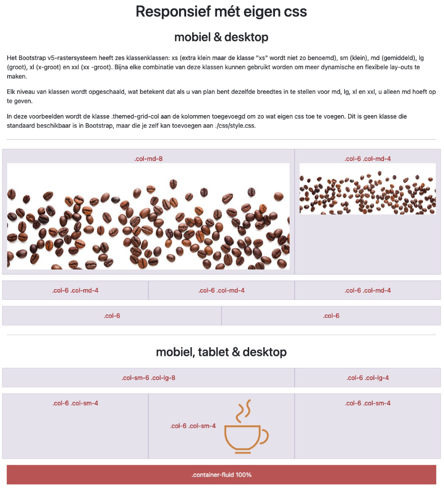

# 💻 LES: W4 - HTML & Bootstrap - Oefening 01

## 🛠️ Opdrachten

### `index.html` openen

 - [ ] Open het bestand `index.html`.

### `style.css` koppelen

- [ ] koppel de eigen css uit `style.css` aan de HTML.

### Voorbeeld Namaken

- [ ] Maak de printscreens zo goed mogelijk na.

#### printscreen iphone12 - 390x844px

#### printscreen ipad-mini 768x1024px

#### printscreen ipad-mini 1024x768px

#### printscreen nest hub max 1280x800px
